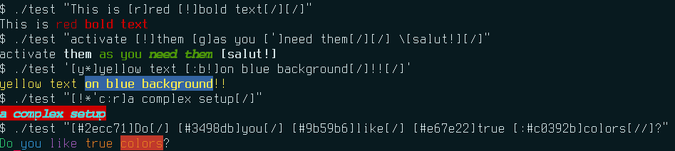
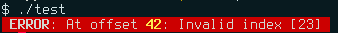

// Show ToC at a specific location for a GitHub rendering
ifdef::env-github[]
:toc: macro
endif::env-github[]

ifndef::env-github[]
:toc: left
endif::env-github[]

// This is to mimic what GitHub does so that anchors work in an offline
// rendering too.
:idprefix:
:idseparator: -

// Other attributes
:cpp: C++

= mint
Philippe Proulx
v0.10.0

[.lead]
_**mint**_ is a single {cpp}11 header to format terminal text
using a simple tag-based markup syntax.

`mint.hpp` offers the `mint::mint()` function which transforms a
string containing terminal attribute tags into another string containing
actual terminal
https://en.wikipedia.org/wiki/ANSI_escape_code#SGR[SGR codes].

`mint::mint()` automatically detects terminal support. If the standard
output isn't connected to a compatible terminal, it removes the
attribute tags instead of converting them to SGR codes.

IMPORTANT: You may copy `mint.hpp` as is to your project. The only
requirements are Linux and {cpp}11.

ifdef::env-github[]
// ToC location for a GitHub rendering
toc::[]
endif::env-github[]

== Markup syntax

_mint_ tags allow you to specify text attributes like colors, bold,
underline, and italic formatting.

The _mint_ markup syntax is straightforward and composable.

An opening tag is, between `[` and `]`, an unordered sequence of
specifiers (all optional, but at least one):

`!`:: Bold.
`-`:: Dim.
`_`:: Underline.
`'`:: Italic.
`^`:: Reverse video.

`*`::
    Bright foreground color.

`:COLOR` (background)::
`COLOR` (foreground)::
    `COLOR` is one of:
+
--
ANSI 16-color palette::
+
[%autowidth]
|===
|`d` |Default
|`k` |Black
|`r` |Red
|`g` |Green
|`y` |Yellow
|`b` |Blue
|`m` |Magenta
|`c` |Cyan
|`w` |White
|===

True color::
    `#` followed with six hex digits (like a CSS color).
--
+
Note that you can set two foreground or background colors within
a single opening tag, for example:
+
----
A [r#e74c3c]wonderful [!:m:#9b59b6]day[//]!
----
+
If you're calling `mint::mint()` in auto mode and
`mint::terminalSupport()` reports only ANSI 16-color palette support,
then this function will ignore the true color specifiers and only keep
the basic ones.

Spaces are allowed between specifiers within an opening tag.

A closing tag contains one or more `/` characters between `[` and `]`.
Each `/` closes one level.

Escape `[` with `pass:[\[]` and `\` with `\\`. Use `mint::escape()` to
escape text for `mint::mint()`. Use `mint::escapeAnsi()` to return to a
plain string (no SGR codes) from the result of `mint::mint()`.

Opening and closing tags may be nested (maximum four levels of depth)
and must be balanced. Note that nesting is additive: a nested tag cannot
cancel an active attribute.

IMPORTANT: The SGR code of any opening and closing tag always
starts with a reset.

Because you must balance opening and closing tags, _mint_ is more suited
to https://fmt.dev/12.0/[pass:[{fmt}]] and `printf()` than I/O streams:

.Using _mint_ with pass:[{fmt}].
====
[source,cpp]
----
fmt::print(mint::mint("[w:r] [!]ERROR[/]: At offset [!*b]{:#x}[/]: {} [/]"),
           exc.offset(), exc.what());
----

NOTE: In this example, `mint::mint()` formats before `fmt::print()`,
therefore we don't need to escape `exc.what()` with `mint::escape()`.
====

== API usage

Include the `mint.hpp` header in your {cpp} code:

[source,cpp]
----
#include "mint.hpp"
----

See the documentation of `mint::mint()`, `mint::escape()`,
`mint::escapeAnsi()`, and `mint::terminalSupport()` in the header
file itself.

This project suggests that you wrap `mint::mint()` into your own
function which at least checks the https://no-color.org/[`NO_COLOR`]
environment variable once to set the `when` parameter of `mint::mint()`
(`mint::When::Auto` or `mint::When::Never`).

== Testing

To test _mint_:

. Build the testers:
+
----
$ mkdir -p build && cd build && cmake .. && make
----

. Test with https://docs.pytest.org/en/stable/[pytest], providing
  the build directory:
+
----
$ MINT_BUILD_DIR=$PWD pytest ../tests
----

== Contributing

To report a bug, https://github.com/efficios/mint/issues/new[create a
GitHub issue].
